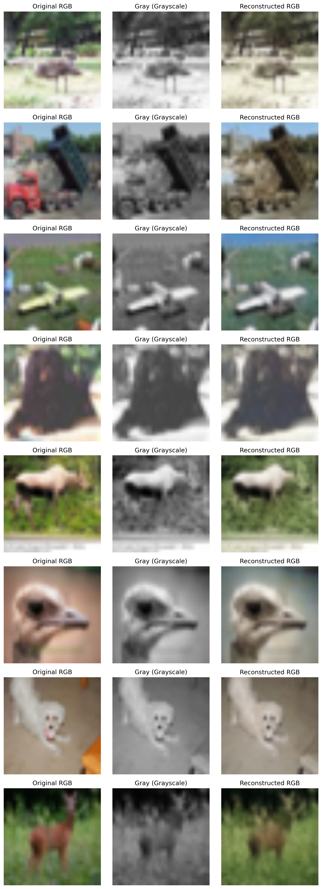

# Grayscale to RGB Image Translation using Finetuned VAE

This project fine-tunes a Variational Autoencoder (VAE) to translate grayscale images into RGB images using a pretrained VAE model from Stability AI. The model is trained and evaluated on the CIFAR-10 dataset.

### Test Results
Below is a sample of the model's performance on the test dataset:




## Features
- Uses a pretrained VAE (`stabilityai/sd-vae-ft-mse`) and fine-tunes it for improved performance
- Converts CIFAR-10 images to grayscale and reconstructs RGB versions
- Tracks training and test loss using Mean Squared Error (MSE)
- Saves model checkpoints periodically

## Installation

Ensure you have Python installed along with the required dependencies:

```bash
pip install torch torchvision diffusers matplotlib tqdm
```

## Usage

### Training the Model
Run the script to fine-tune the VAE on grayscale-to-RGB conversion:

```bash
python train.py
```

### Model Checkpoints
Model checkpoints are saved every `save_interval` epochs in the `./checkpoints` directory. The final model is stored as `vae_final`.

## Implementation Details

- **Dataset**: CIFAR-10
- **Pretrained Model**: `stabilityai/sd-vae-ft-mse` (fine-tuned on CIFAR-10)
- **Loss Function**: MSE Loss
- **Optimizer**: AdamW
- **Training Parameters**:
  - Batch Size: 8
  - Learning Rate: 1e-5
  - Epochs: 10

## Results
After fine-tuning, the model can reconstruct RGB images from grayscale inputs with improved quality. The reconstruction quality can be evaluated based on the test loss.

## Future Improvements
- Apply this technique to higher-resolution datasets
- Further fine-tune the VAE with custom datasets
- Experiment with additional loss functions like perceptual loss

## License
This project is open-source and can be modified for research purposes.


